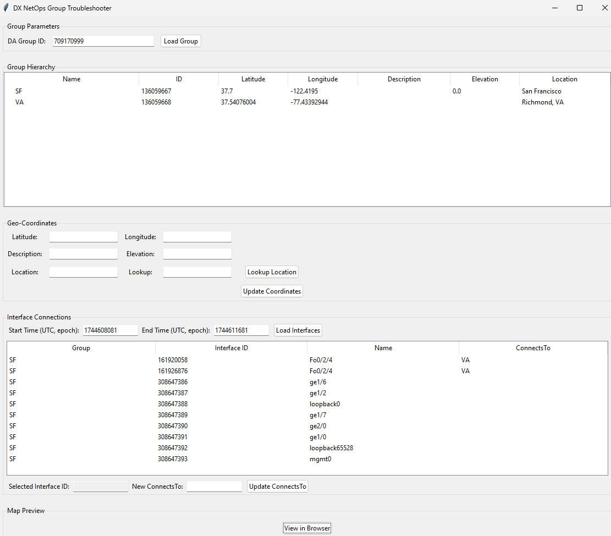
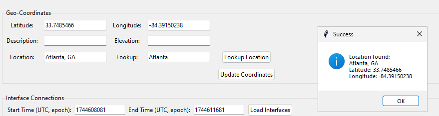
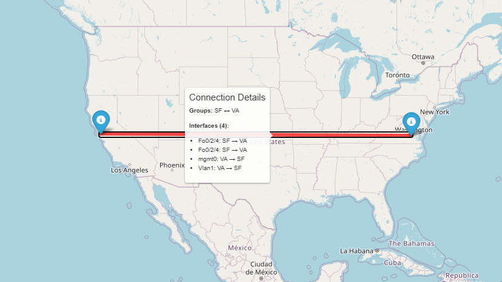

# DX NetOps Group Troubleshooter (Tkinter UI)

A graphical Python application for troubleshooting and managing Broadcom DX NetOps Portal groups and interfaces, with real-time integration to the DX NetOps OData and REST APIs.



---

## Features

- **Group Hierarchy Display:** Load and visualize DA group and subgroup structure.
- **Geo-Coordinate Management:** View and update latitude/longitude, elevation, description, and location for groups. Includes location lookup via Bing Maps API.


- **Interface Connection Management:** List interfaces for a group and time range, showing both source group and destination, and edit their `ConnectsTo` destinations.
- **Map Preview:** Visualize group locations on an interactive map (folium).
- **Real Data Integration:** Uses live OData and REST API calls with Basic Auth.

---

## Setup & Installation

### 1. Clone the Repository

```bash
git clone <your-repo-url>
cd <repo-directory>
```

### 2. Install Dependencies

Python 3.8+ is required.

```bash
pip install -r requirements.txt
```

### 3. Configure Environment Variables

Copy `.env.example` to `.env` and fill in your credentials:

```
DX_NETOPS_HOST=https://<pc_host>:8182 # e.g. https://pm.internal.us:8182
DX_DA_HOST=http://<da_host>:8581 # e.g. http://da.internal.us:8581
DX_NETOPS_USERNAME=your_username
DX_NETOPS_PASSWORD=your_password
BING_MAPS_API_KEY=your_bing_maps_api_key
```

- `DX_NETOPS_HOST`: The OData/REST API host for the DX NetOps Portal.
- `DX_NETOPS_USERNAME` / `DX_NETOPS_PASSWORD`: Your API credentials.
- `DX_DA_HOST`: The Data Aggregator REST host (for interface ConnectsTo updates).
- `BING_MAPS_API_KEY`: Your Bing Maps API key for location lookup (get one at https://www.bingmapsportal.com/).

### 4. Run the Application

```bash
python app/main.py
```

---

## How It Works: Data Flow & API Details

### 1. **DA Group ID to PC ID Conversion**

- **Purpose:** The user provides a DA Group ID. The app converts this to a PC ID required for further queries.
- **API Call:**  
  `POST {DX_NETOPS_HOST}/pc/center/webservice/datasources/dataSourceId/3/itemids`
- **Request Body:**
  ```xml
  <LocalIDs>
    <LocalID ID="{DA_GROUP_ID}"/>
  </LocalIDs>
  ```
- **Response:**  
  XML with `<ItemIDResult LocalID="..." ItemID="..."/>`  
  The `ItemID` is the PC ID.

### 2. **Fetching Group Hierarchy**

- **Purpose:** Retrieve group/subgroup structure and metadata.
- **API Call:**  
  `GET {DX_NETOPS_HOST}/pc/center/webservice/groups/groupItemId/{PC_ID}`
- **Response:**  
  XML `<GroupTree>` with `<Group>` children, each with attributes and elements for ID, name, latitude, longitude, etc.

### 3. **Updating Group Coordinates**

- **Purpose:** Set latitude/longitude (and optionally elevation, location description) for a group.
- **API Call:**  
  `POST {DX_NETOPS_HOST}/pc/center/webservice/groups/groupItemId/{PC_ID}`
- **Request Body:**
  ```xml
  <GroupTree path="/All Groups/WEATHERMAP">
    <Group version="1.0.0" type="site" name="" id="{PC_ID}">
      <Longitude>{longitude}</Longitude>
      <Latitude>{latitude}</Latitude>
      <Elevation>{elevation}</Elevation>
      <LocationDesc>{location_desc}</LocationDesc>
    </Group>
  </GroupTree>
  ```
- **Response:**  
  XML with updated group info.

### 4. **Fetching Interface Data (OData Query)**

- **Purpose:** List all interfaces for a group and time range, including their `ConnectsTo` destinations.
- **API Call:**  
  ```
  GET {DX_NETOPS_HOST}/pc/odata/api/groups
    ?$apply=groupby((portmfs/ID), aggregate(portmfs(im_Availability with average as Value, im_UtilizationIn with average as Value1, im_PctDiscards with average as Value2, im_PctErrors with average as Value3, im_UtilizationOut with average as Value4)))
    &$expand=interfaces
    &$select=ID,Name,Longitude,Latitude,LocationDesc,GroupPathLocation,interfaces/ID,interfaces/Name,interfaces/SpeedIn,interfaces/SpeedOut,interfaces/AlternateName,interfaces/ConnectsTo
    &$filter=((substringof('{DA_ID}:', GroupPathLocationIDs) eq true) and (GroupType eq 'site'))
    &$format=text/csv
    &starttime={start_epoch}
    &endtime={end_epoch}
    &resolution=HOUR
    &$top=500
  ```
- **Response:**  
  CSV rows, each with group and interface fields:
  - `ID`, `Name` (group info)
  - `interfaces/ID`, `interfaces/Name`, `interfaces/ConnectsTo`, etc.

### 5. **Updating Interface ConnectsTo**

- **Purpose:** Set the `ConnectsTo` destination for an interface.
- **API Call:**  
  `PUT {DX_DA_HOST}/rest/ports/customattributes/{INTERFACE_ID}`
- **Request Body:**
  ```xml
  <PortCustomAttributes version='1.0.0'>
      <ConnectsTo>{destination}</ConnectsTo>
  </PortCustomAttributes>
  ```
- **Response:**  
  XML with update status.

---

## UI Usage Guide

1. **Enter DA Group ID** and click "Load Group".
   - The app fetches the group hierarchy and sets the default time range (last hour).
2. **View Group Hierarchy** in the tree.
   - Select a group to view/edit its coordinates.
3. **Edit Coordinates** in the Geo-Coordinates section.
   - You can enter a location in the "Lookup" field and click "Lookup Location" to automatically populate coordinates using Bing Maps.
   - Fill in other fields like Description, Elevation, and Location as needed.
   - Click "Update Coordinates" to save changes via REST.
4. **Set Time Range** (epoch UTC) and click "Load Interfaces".
   - The app fetches interfaces for the group and time range.
5. **Select an Interface** in the table.
   - Edit the "ConnectsTo" field and click "Update ConnectsTo" to save.
6. **Map Preview:** Click "View in Browser" to see all groups with coordinates on a map.



---

## Security & Authentication

- All API calls use HTTP Basic Auth with credentials from `.env`.
- Credentials are never stored in code or logs.
- Ensure `.env` is not committed to version control.

---

## Troubleshooting

- **SSL Verification:** The app disables SSL verification for API calls. For production, configure proper certificates.
- **API Errors:** Errors are shown in popups with a "Copy to Clipboard" feature for easy sharing. Check credentials, endpoint URLs, and network connectivity.
- **Missing Data:** If groups or interfaces do not appear, verify the DA Group ID and time range.
- **Location Lookup:** Requires a valid Bing Maps API key in your .env file. If you encounter errors, ensure your key is valid and your organization allows access to the Bing Maps API.

---

## Extending & Customizing

- The codebase is modular: API logic is in `app/api/client.py`, UI in `app/ui/main_window.py`.
- You can add new features (e.g., more group attributes, advanced map overlays) by extending these modules.

---

## License

MIT License (or your preferred license)

---

## Contact

For questions or support, contact your DX NetOps administrator or the project maintainer.
